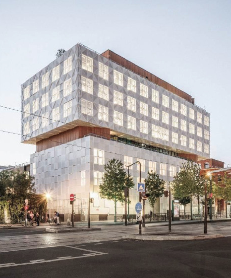

<br><br><br>

**Hello, I'm Lizzie - @LizAnani77**

```
Currently:  Student at 42
Email:      lanani-f@student.42.fr
Location:   Paris, FR
```

<br clear="both"/>

---

<div align="center">

**`🌊 My journey`**

`After` **`20 years at Agnès b`** `as Store Manager, I made a career shift into tech by joining` **`42 Paris`**.  
`I recently completed the common core — months of intensive coding, debugging, and still learning.`

---

**`💻 42 Projects`**

🔹 **`Transcendence`** : `Fullstack Pong web app` · `TypeScript` · `Node.js` · `Docker`  
🔹 **`Ft_irc`** : `IRC server in C++` · `connections` · `channels` · `protocol`  
🔹 **`Inception`** : `Multi-container infrastructure` · `Docker Compose`  
🔹 **`Minishell`** : `Bash-like shell` · `parsing` · `pipes` · `redirections`  
🔹 `Also` : `Pipex` `Fract-ol` `Born2beroot` `Libft` `Philosophers`

---

**`🌐 Hackathon`**

🔹 **`Hacking Paris — Chiliz World Tour`** · `Parc des Princes` · `July 2025`  
`Built a Web3 MVP on Chiliz Chain: fan tokens, NFT, teamwork under pressure.`

---

**`💎 Strengths`**

🔹 `Leadership & team management`  
🔹 `Communication & client focus`  
🔹 `Clean, maintainable code`

---

**`🛠️ Tech stack`**

`TypeScript` `JavaScript` `HTML` `CSS` `Node.js` `Fastify` `C` `C++` `Docker` `SQL` `Git`

---

**`📘 Languages`**

🔹 `French (native)` · `English (professional)` · `Spanish (basic)`

---

`Outside the screen, I 💙 science and especially Quantum Physics!`

✉ `lanani-f@student.42.fr`

</div>
